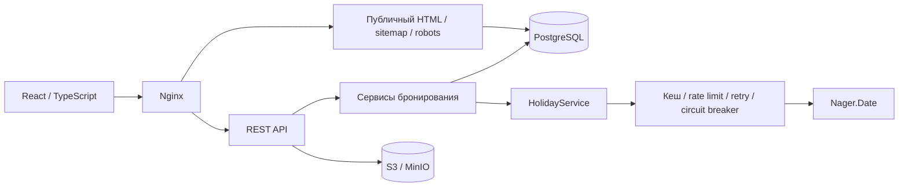

# Лабораторная работа №4 — SEO и внешнее API

RoomFlow: бронирование переговорных комнат. Продолжение [исходного MVP](https://github.com/IWKMS99/RoomFlow) на согласованном стеке Java 24 / Spring Boot 3, React 19 / TypeScript, PostgreSQL и S3. История разработки сохранена.

## Что реализовано

- Публичное расписание и страницы переговорных с семантической разметкой, title, description, canonical, Open Graph и JSON-LD (`WebApplication` / `Place`). Метаданные публичных страниц присутствуют уже в HTML сервера, до выполнения JavaScript; React обновляет их при переходах.
- Динамические `sitemap.xml` и `robots.txt`, учитывающие `APP_PUBLIC_BASE_URL`. В sitemap только публичное расписание и активные комнаты. Личные разделы и аутентификация исключены из индексации.
- Корректный HTTP 404 для отсутствующей/неактивной комнаты и неизвестного URL в контейнерном окружении. Неизвестная комната не подменяется успешным HTTP 200.
- Изображения комнат, разбиение JS на chunks, lazy loading страниц входа/регистрации, сжатие gzip и длительный кеш файлов с хешированными именами.
- Серверная интеграция Nager.Date: адаптер `HolidayGateway`, нормализация ответа, ограничение запросов, таймауты, повторные попытки, circuit breaker и кеш успешных ответов.
- В интерфейсе отдельные состояния загрузки, отсутствия праздников и ошибки с повторной загрузкой. При недоступности календаря можно просматривать расписание; подтверждение новых броней приостанавливается, чтобы не обойти правило праздничных дней. Отмена существующей брони остаётся доступна.

## Архитектура



Аспекты кеширования и устойчивости расположены в отдельном Spring bean, поэтому они применяются и при проверке календаря внутри бизнес-операций. Ответ ошибки не кешируется как пустой список праздников. Оба типа запроса (UI и бронирование) используют один адаптер.

## Запуск

Нужны Docker с Compose. Скопировать `.env.example` в `.env`, задать собственные значения секретов. Нельзя использовать демонстрационные значения в публичном окружении.

```bash
cp .env.example .env
docker compose -f docker-compose.prod.yml up --build -d
```

Приложение: `http://localhost:8080`. MinIO console: `http://localhost:9001`. Для S3 из браузера `S3_PUBLIC_ENDPOINT` должен быть доступным адресом, а не контейнерным DNS. Бакет закрытый; приложение выдаёт временные подписанные ссылки.

Для разработки frontend отдельно:

```bash
cd frontend
npm ci
npm run dev
```

Backend: JDK 24, PostgreSQL, MinIO и переменные окружения из `.env`. `./gradlew bootRun` (Windows: `gradlew.bat bootRun`). Vite проксирует API на `localhost:8081` либо `VITE_PROXY_TARGET`.

## Конфигурация интеграции

| Переменная | Назначение |
|---|---|
| `APP_PUBLIC_BASE_URL` | Публичный HTTPS origin для серверных метаданных и sitemap |
| `VITE_PUBLIC_BASE_URL` | Необязательный origin для клиентских метаданных; по умолчанию текущий origin |
| `HOLIDAY_API_BASE_URL` | Адрес провайдера, по умолчанию `https://date.nager.at` |
| `HOLIDAY_API_TIMEOUT_MS` | Connect/read timeout, по умолчанию 1000 мс |
| `HOLIDAY_DEFAULT_COUNTRY` | Двухбуквенный код страны, по умолчанию RU |

Nager.Date public API не требует ключа. Ключи хранилища и JWT передаются через окружение; значения секретов не включаются в клиентскую сборку. Если провайдер требует авторизации, ключ должен оставаться в серверном адаптере.

Ограничения по умолчанию: 10 исходящих вызовов в секунду на экземпляр; до двух попыток с паузой 500 мс; кеш успешного ответа 24 часа, не более 200 записей; circuit breaker открывается на 30 секунд после превышения 50% ошибок в окне (минимум 5 вызовов). Валидация API: год 1970–2100, код страны из двух букв. При масштабировании лимит каждого экземпляра нужно согласовать с общей квотой провайдера.

## Проверка

```bash
cd frontend
npm ci
npm run lint
npm run test
npm run build
cd ..
./gradlew check
```

Перед тестами серверных HTML-страниц необходимо собрать frontend: Gradle включает `frontend/dist` в ресурсы приложения. PostgreSQL для интеграционных тестов запускается Testcontainers в отдельном контейнере. Дополнительно `cd frontend && npx playwright install chromium && npm run test:e2e` проверяет интерфейс с контролируемыми ответами API.

Проверяемые сценарии: отсутствие комнаты → 404/noindex; исходный HTML содержит canonical/OG/JSON-LD; sitemap содержит активные комнаты; robots содержит правильный origin; календарь недоступен → HTTP 503; попытка бронирования при ошибке календаря → 503 без создания записи; праздничная дата → 409.

## Ограничения и решения

- Локальный Vite — сервер разработки, проверять поисковые HTTP-статусы следует через production Nginx.
- Сервер формирует SEO-оболочку, интерактивное расписание загружается React. Это не полный SSR React-компонентов.
- Open Graph изображение по умолчанию — встроенный SVG; для социальных сетей, принимающих только PNG/JPEG, следует задать `image` с растровым изображением комнаты.
- Nager.Date отражает общегосударственные праздники, а не полный производственный календарь компании. Переносы рабочих дней требуют отдельного источника.
- Приватные маршруты дополнительно защищены API/RBAC; robots.txt не является механизмом безопасности.

Документация: [Nager.Date API](https://date.nager.at/Api), [Resilience4j](https://resilience4j.readme.io/docs/getting-started-3), [Google: JavaScript SEO](https://developers.google.com/search/docs/crawling-indexing/javascript/javascript-seo-basics).
